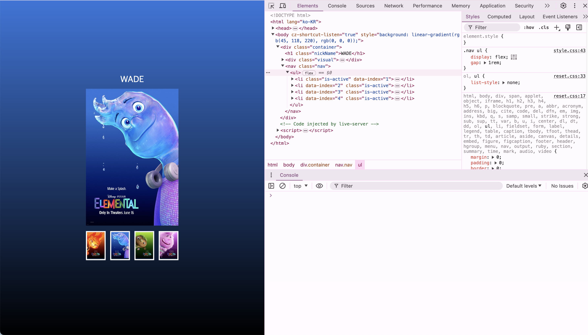
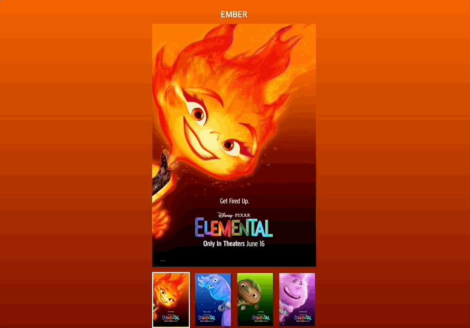

## Elemental 포스터 만들기!

썸네일 이미지를 클릭하면 메인 이미지와 배경이 바뀔 수 있도록 코드 로직을 작성해주세요.

1. 클릭이벤트 활성화
먼저 navigation.addEventListener로 클릭이벤트를 활성화시키도록 작성하였다
함수로 이벤트의 기본 동작을 막기 위해 e.preventDefault()를 작성하였다.
콘솔로 찍어보니 작동을 안해서 왜 그런가 했더니 navigation이 뭔지를 지정해주지 않았다. getNode로 불러올 수도 있지만 getNode함수를 짜는 것은 생각도 안해봤기 때문에 그냥 document.querySelector()로 nav를 불러왔다
잘 작동하였다

포스터 사진만 클릭되고, 그 외에는 클릭이 되지 않도록 포스터 사진들이 들어있는 li를 수집하기 위해서 const target = e.target.closest('li')를 사용했다. 근데 안되었다,, 왜?

만약에 타겟이 아니라면 return하는 코드를 작성하였다. 타겟이 null일때 함수가 작동하지 않도록 하기 위해서다!
이 코드를 작성하니 내가 원하는 곳만 클릭이 되었다.

2. nav 클릭시 배경 색상 변경
li를 클릭하면 배경이 바뀌도록 만들어야한다. 원하는 곳만 클릭이 가능하게 만들었고 이제 배경색상만 가지고 오면되는데,,
this.style.background = `linear-gradient(to bottom, #ff7e5f, #feb47b)`; this로 해서 작동을 시켜보니 ul이 바뀌었다..아니 왜?
document.querySelector('body').style.background = `linear-gradient(to bottom, #ff7e5f, #000)`; this가 아니라 body가 바뀌어야하니 document.querySelector('body')로 위치를 지정해주고 작성했더니 일단 한번은 바뀌었다
data.js에 있는 걸 가져다가 사용해야하는데 어떻게 써야할까?

3. 이미지 변경
이제 해당 이미지들의 data-index의 넘버에 접근하기 위해서 코드를 작성해줘야한다. dataset을 사용해서 접근하면 된다!
const indexData = target.dataset.index;로 콘솔에 data-index 번호가 나오도록 하였다

4. 이미지와 설명 변경
const visualImage = document.querySelector('.visual img');로 변경하고자는 공간을 선택해주고, visualImage.src = `./assets/${data[indexData-1].name}.jpeg`; data-index 넘버에 접근해서 바꿔주도록 했다! 잘 바뀐다!
visualImage.alt = data[indexData-1].alt;로 하니 잘 바뀐다

5. 텍스트 변경
document.querySelector('.nickName').textContent = data[indexData-1].name; 변경하고자 하는 공간을 선택해주고 이름을 바꿔주었다

6. is-active 넣고 빼기
target.classList.add('is-active');로 is-active를 넣어줬다
remove로 빼줘야하는데 li전부를 잡고 remove로 빼줘야한다
근데 안빠진다 왜? 몰라

